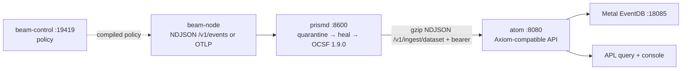

# Familiarization: beam / prism / atom

Surveyed 2026-08-28 via three parallel scouts. Checkouts:

| Project | Repo | Live branch | Local path |
|---|---|---|---|
| beam | axiomhq/beam | `njpatel/init` (only real content; `mail` is empty) | `~/.herdr/worktrees/beam/njpatel-init` |
| prism | axiomhq/prism | `main` | `~/src/overstreamhq-prism/main` |
| atom | axiomhq/atom | `njpatel/init` = origin/main + local licensing-design commits | `~/.herdr/worktrees/atom/njpatel-init` |

## One-line each

- **beam** — Rust reactive host agent shipped in the OS image: unprivileged `beam-node` collects host/process/inventory/attribution/GPU/adapter signals; privileged `beam-sensor` (aya eBPF) feeds it; `beam-control` (WS `127.0.0.1:19419`) governs policy and the approved-adapter catalogue. Egress: NDJSON `POST /v1/events` or OTLP/HTTP `/v1/logs`+`/v1/metrics`, per-QoS idempotency keys, SQLite WAL transport. Slices 0–8 done; single init commit.
- **prism** — Rust (`prismd`, 33 crates) self-healing security-log ingest: known formats transpile deterministically to validated **OCSF 1.9.0**; unknown/drifted records quarantine → offline model heals a declarative artifact behind schema/golden gates → backlog replays with original timestamps. Ingest `:8600` (`POST /v1/ingest/{dataset}` NDJSON + Splunk HEC), admin/mgmt `:8601`, leader control `:8610`. Egress: gzip NDJSON to Axiom-shaped `{base}/v1/ingest/{dataset}` with bearer token. Gates G0–G6 pass; G7 soak not run. Cloudflare Worker prototype kept as byte-parity oracle.
- **atom** — Go single binary (`atom serve|migrate`, `:8080`) putting an Axiom-compatible management/product surface in front of headless **Axiom Metal EventDB** (`:18085` in demo compose): Postgres-backed datasets/tokens(`xaat-`)/users/orgs/audit/usage, v1/v2 dataset CRUD, APL query (`/v1/datasets/_apl`), NDJSON/JSON/CSV + OTLP ingest, embedded React console. Verified consumer of splunk-portal/grafana-portal. Recent local commits are licensing *design only* (D10, `//go:build metal`).

## The integration story (why this epic is named beam-prism-atom)

- **prism → atom is near-drop-in**: prism's Axiom sink speaks exactly the API atom implements (`/v1/ingest/{dataset}`, bearer token, NDJSON, `_time` derivation). Point `prism-dest` base URL at atom with an `xaat-` token.
- **beam → prism has a seam gap**: beam's NDJSON scheme posts to a fixed `/v1/events` path; prism listens on `/v1/ingest/{dataset}` (or HEC). Beam's EventEnvelope is also not a known prism source format — which is arguably the demo: it quarantines and the heal loop derives an artifact. Options: teach beam a configurable path/dataset, add a `/v1/events` compat route to prism-listen, or front with HEC. Decide at planning time.
- **Naming discrepancy to resolve with Neil**: beam's docs (DECISIONS.md:21-27, docs/architecture.md) describe "prism" as a *Go fleet relay* doing tail sampling, consuming beam-control-compiled policy. axiomhq/prism as built is the Rust OCSF ingest service. Either beam's docs predate a pivot, or beam expects a different/thinner relay component. Must clarify before wiring.
- Cross-references today: **zero**. None of the three repos mentions the other two by name (except beam's aspirational "prism relay"). All integration is protocol-level, greenfield.

## Key commands (as documented per repo)

- beam: `cargo build --release -p beam|beam-sensor|beam-subprocess-executor`; eBPF via `scripts/build-ebpf.sh` (nightly-2026-08-12); lab via `cargo xtask lab …`; adiyogi test scripts in `scripts/`.
- prism: `cargo build --workspace`; `cargo xtask ci`; run `PRISM_DATA_DIR=… PRISM_OBJECT_DIR=… ./target/release/prismd`; loadgen `cargo xtask loadgen http://127.0.0.1:8600 dev-token 10000 10`.
- atom: `make build && ./bin/atom migrate && ./bin/atom serve`; `make test`; integration needs `ATOM_TEST_POSTGRES_URL` + `ATOM_TEST_EVENTDB_URL`; demo `make demo-up`.

## Port map (defaults)

| Service | Port |
|---|---|
| beam-control WS | 127.0.0.1:19419 |
| beam-capture test sink | 127.0.0.1:19418 |
| prism ingest / admin / control | 8600 / 8601 / 8610 |
| atom API+console | :8080 |
| Metal EventDB (demo) | :18085 |

Full scout transcripts: `history://AtomScout`, `history://BeamScout`, `history://PrismScout` (session-local).
